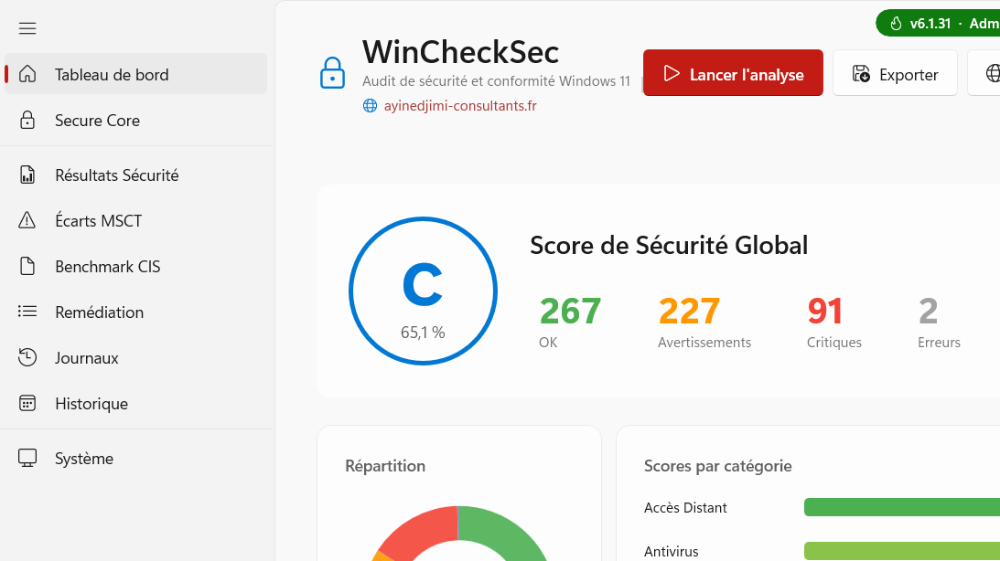

<div align="center">

# 🛡️ CHECKSEC

### Auditeur de posture de sécurité Windows 11 — rapide, complet, hors-ligne

**756 contrôles · 59 collecteurs · baselines MSCT & CIS · rapports signés SHA‑256**

[](https://www.microsoft.com/windows/windows-11)
[](https://dotnet.microsoft.com/)
[](https://learn.microsoft.com/windows/apps/winui/)
[](#-installation)
[](LICENSE)
[](https://ayinedjimi-consultants.fr)

🇫🇷 **Français** · [🇬🇧 English](README.en.md)

</div>

---

## 📸 Aperçu

<div align="center">

<br><em>Tableau de bord — score global, lancement d'analyse, export</em>
</div>

> _D'autres captures dans [`docs/screenshots`](docs/screenshots) : Secure Core, résultats, écarts MSCT, CIS, remédiation._

---

## 🎯 En bref

**CHECKSEC** analyse en profondeur la configuration de sécurité d'un poste **Windows 11** et la compare aux référentiels **Microsoft Security Compliance Toolkit (MSCT)** et **CIS Benchmark**. Il produit un score, un plan de remédiation priorisé, et des rapports exploitables pour une **étude a posteriori** (forensique / conformité).

- 🔒 **100 % local & hors‑ligne** — aucune donnée ne quitte le poste.
- ⚡ **Rapide** — 59 collecteurs exécutés **en parallèle**, analyse complète en quelques secondes.
- 📦 **Portable** — un seul `.exe` auto‑contenu (aucune installation de .NET requise).
- 🧾 **Rapports riches** — JSON forensique (hash d'intégrité SHA‑256), PDF, Excel, HTML, CEF (SIEM).

---

## ✨ Fonctionnalités clés

| Domaine | Ce qui est audité |
|---|---|
| 🦠 **Antivirus / EDR** | Microsoft Defender (temps réel, tamper protection, cloud, ASR, CFA), **Defender for Endpoint (MDE)**, et **AV/pare‑feu tiers** via `SecurityCenter2` (nom, activé, signatures à jour) |
| 🔐 **Chiffrement & Boot** | BitLocker (méthode, protecteurs, TPM+PIN), **Secure Boot**, **VBS / Credential Guard / HVCI / Kernel DMA Protection** (état *running* réel via WMI) |
| 🌐 **Réseau** | LLMNR / NBT‑NS / mDNS (empoisonnement Responder), SMB signing v1/v2/3, TLS/cipher suites, WPAD, NTLM, pare‑feu par profil, DoH |
| 📶 **WiFi** | Profils WLAN : réseaux **ouverts / WEP / TKIP**, 802.1X sans validation de certificat, auto‑connexion hotspots, randomisation MAC |
| 👤 **Comptes & Auth** | Politique de mots de passe, membres **Administrateurs local**, comptes dormants, Kerberos, LAPS, LSA, WDigest, UAC |
| 🧩 **Surface d'attaque** | Autoruns & persistance, tâches planifiées, **AlwaysInstallElevated**, macros Office (VBA/DDE/ActiveX), PowerShell logging, WDAC/AppLocker, ASR, Exploit Protection |
| 🌍 **Navigateurs** | Politiques Edge / Chrome : SmartScreen, extensions imposées, restrictions de téléchargement, TLS min |
| 🗂️ **Journaux & Forensique** | Vraies erreurs Critical/Error des journaux Windows, taille/rétention des logs, événements de sécurité clés |
| 💿 **Inventaire** | Logiciels installés (registre + **AppX/MSIX**), logiciels **à risque / EOL**, extensions navigateur, Sysmon |

➡️ **Liste exhaustive des 756 contrôles : [`docs/CHECKS.md`](docs/CHECKS.md)** · 🗺️ [Feuille de route](docs/ROADMAP.md)

---

## 🚀 Installation

### Option 1 — Exécutable portable (recommandé)
1. Téléchargez `CHECKSEC.exe` depuis la [**dernière release**](https://github.com/ayinedjimi/CHECKSEC/releases/latest).
2. Double‑cliquez. Acceptez l'invite **UAC** (l'analyse nécessite des privilèges administrateur).
3. Cliquez sur **Lancer l'analyse**.

> Prérequis : Windows 11 x64 + [**Microsoft Visual C++ Redistributable (x64)**](https://aka.ms/vs/17/release/vc_redist.x64.exe). CHECKSEC le détecte au démarrage et propose son téléchargement s'il manque. .NET et WindowsAppSDK sont **embarqués** — rien d'autre à installer.

### Option 2 — Mode headless (CLI / automatisation)
```powershell
CHECKSEC.exe --headless --output rapport.json --format json
# formats : json | cef
```

---

## 🖥️ Utilisation

- **Tableau de bord** : score global, grade, lancement/annulation d'analyse, export.
- **Secure Core** : tuiles matérielles (VBS, Credential Guard, HVCI, DMA, Secure Boot, TPM) — état *réel*.
- **Résultats / Écarts MSCT / CIS** : filtrage, recherche, tri, export ciblé.
- **Remédiation** : plan d'actions priorisé avec commandes.
- **Historique** : comparaison d'analyses dans le temps.

📖 Guide détaillé : [`docs/USAGE.fr.md`](docs/USAGE.fr.md) · [🇬🇧 Usage guide](docs/USAGE.en.md)

---

## 🧾 Rapports & export forensique

Le rapport JSON (sauvegardé sur le Bureau) est conçu pour une **exploitation a posteriori** :

- `SchemaVersion`, blocs `Host` / `Execution` (contexte, élévation, fenêtre temporelle d'analyse) ;
- `CollectedAt` **par contrôle**, horodatage **ISO‑8601 / UTC** ;
- **`AnalysisLog`** — journal d'exécution (statut/durée/nombre de résultats par collecteur) ;
- **`Integrity`** — empreinte **SHA‑256** re‑vérifiable du rapport (non‑répudiation) ;
- Détail MSCT (baseline vs réel), CIS par contrôle, vraies erreurs des journaux Windows.

Autres formats : **PDF** (QuestPDF), **Excel** (ClosedXML), **HTML**, **CEF** (SIEM).

---

## 🏗️ Compiler depuis les sources

```powershell
# Prérequis : SDK .NET 9, sous Windows (le compilateur XAML WinUI est Windows-only)
git clone https://github.com/ayinedjimi/CHECKSEC.git
cd CHECKSEC
dotnet build CHECKSEC.sln -c Release -p:Platform=x64

# Exe portable single-file
dotnet publish CHECKSEC/CHECKSEC.csproj -c Release -r win-x64 -p:Platform=x64 `
  --self-contained true -p:PublishSingleFile=true `
  -p:IncludeNativeLibrariesForSelfExtract=true -p:WindowsAppSDKSelfContained=true
```

Architecture du code (pour contribuer) : [`docs/ARCHITECTURE.md`](docs/ARCHITECTURE.md).
Ajouter un collecteur = créer une classe `ISecurityCollector` + une ligne dans `BuildCollectors()`.

---

## 🔒 Confidentialité & éthique

CHECKSEC est un outil **défensif** d'audit. Il **lit** l'état du système (registre, WMI, services) et **ne modifie rien**. Aucune donnée n'est transmise sur le réseau. À utiliser sur des systèmes que vous êtes autorisé à auditer.

---

## 👤 Auteur & services

Développé par **Ayi NEDJIMI** — [**Ayi NEDJIMI Consultants**](https://ayinedjimi-consultants.fr), expert en cybersécurité offensive & IA.

📚 **Articles & ressources en lien** :
- [622 CVEs Microsoft en un mois : votre SI peut‑il suivre ?](https://ayinedjimi-consultants.fr/articles)
- [Audit de Sécurité Informatique PME : Guide Complet](https://ayinedjimi-consultants.fr/articles)
- [Audit Interne ISO 27001 : Méthode & Checklist](https://ayinedjimi-consultants.fr/iso-27001)
- [Audit Microsoft 365](https://ayinedjimi-consultants.fr/audit-microsoft-365) · [Conformité NIS 2](https://ayinedjimi-consultants.fr/nis-2)

💼 Besoin d'un audit de sécurité professionnel ? [**Demandez un devis →**](https://ayinedjimi-consultants.fr/contact)

---

## 📄 Licence

Distribué sous licence **MIT** — voir [`LICENSE`](LICENSE).

<div align="center">
<sub>⭐ Si CHECKSEC vous est utile, laissez une étoile et rejoignez les <a href="https://github.com/ayinedjimi/CHECKSEC/discussions">Discussions</a> !</sub>
</div>
