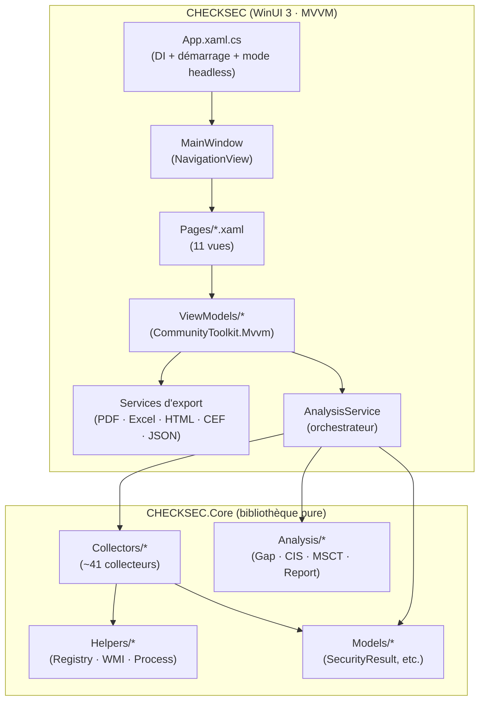
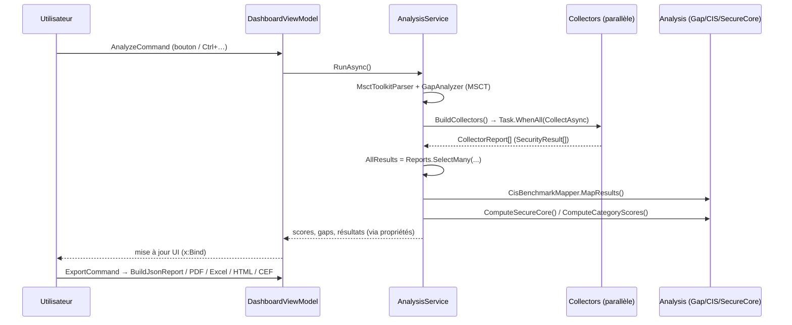

# CHECKSEC — Architecture du code

Document de référence pour comprendre et **faire évoluer** l'application. CHECKSEC est un outil d'audit de posture de sécurité Windows 11 (.NET 9 / WinUI 3, version 6.0.0) : il collecte l'état de dizaines de mécanismes de sécurité, les compare aux baselines **MSCT** (Microsoft Security Compliance Toolkit) et **CIS**, calcule un score, et produit des rapports.

---

## 1. Vue d'ensemble



**Principe directeur** : toute la logique métier (collecte, analyse, modèles) vit dans **`CHECKSEC.Core`**, une bibliothèque **sans aucune dépendance UI**. La couche **`CHECKSEC`** (WinUI 3) ne fait qu'orchestrer, présenter et exporter. On peut ainsi tester/réutiliser le moteur (le mode `--headless` s'en sert sans interface).

---

## 2. Structure de la solution

```
src/
├── CHECKSEC.sln
├── CHECKSEC.Core/                      ← MOTEUR (net9.0-windows, bibliothèque)
│   └── CHECKSEC/Core/
│       ├── Models/                     ← objets de données (DTO/enums)
│       └── Services/
│           ├── Collectors/             ← ~41 collecteurs (ISecurityCollector)
│           ├── Analysis/               ← analyse & baselines (Gap, CIS, MSCT)
│           ├── Helpers/                ← accès système (Registry, WMI, Process)
│           ├── ErrorLogger.cs          ← journalisation interne
│           ├── LogEntry.cs / LogLevel.cs
└── CHECKSEC/                           ← UI WinUI 3 (net9.0-windows10.0.22621.0)
    ├── App.xaml(.cs)                   ← point d'entrée, DI, mode headless
    ├── MainWindow.xaml(.cs)            ← NavigationView + navigation clavier
    ├── Pages/                          ← 11 pages XAML + code-behind
    ├── ViewModels/                     ← 1 VM par page (MVVM)
    ├── Services/                       ← AnalysisService + exports + persistance
    ├── Controls/                       ← contrôles graphiques (charts)
    ├── Helpers/                        ← convertisseurs XAML (IValueConverter)
    ├── app.manifest / app.ico
    └── AUDIT_CHECKSEC.md / ARCHITECTURE.md / README_RECONSTRUCTION.md
```

**Espaces de noms** : moteur = `CHECKSEC.Core.*` (`.Models`, `.Services.Collectors`, `.Services.Analysis`, `.Services.Helpers`) ; UI = `CHECKSEC.*` (`.Services`, `.ViewModels`, `.Pages`, `.Controls`, `.Helpers`).

---

## 3. Flux d'exécution (du clic à l'export)



**Étapes clés de `AnalysisService.RunAsync()`** :
1. Parse le MSCT Toolkit (`MsctToolkitParser`) → politiques baseline → `GapAnalyzer.Analyze()` → écarts (`ComplianceGap`).
2. `BuildCollectors()` construit la liste des collecteurs puis les exécute **en parallèle** (`Task.WhenAll`), chacun avec un **timeout individuel de 30 s** (`RunCollectorSafeAsync`).
3. Agrège tous les `SecurityResult` dans `AllResults`.
4. `CisBenchmarkMapper.MapResults()` mappe les résultats sur les contrôles CIS.
5. `ComputeSecureCore()` (tuiles matérielles) et `ComputeCategoryScores()` (score par catégorie + score global).
6. Expose tout via des propriétés publiques consommées par les ViewModels et les exports.

**Progression** : `AnalysisService` expose les événements `ProgressChanged(done, total, status)` et `CollectorCompleted(report)` pour l'UI.

---

## 4. Le moteur — `CHECKSEC.Core`

### 4.1 Contrat des collecteurs — `ISecurityCollector`
```csharp
public interface ISecurityCollector
{
    string Name { get; }        // libellé du module
    string Category { get; }    // catégorie de regroupement/scoring
    Task<CollectorReport> CollectAsync(CancellationToken ct = default);
}
```
Chaque collecteur lit une facette du système (registre, WMI, processus) et renvoie un `CollectorReport` contenant une liste de `SecurityResult`. **Contrat important** : les collecteurs sont instanciés via `new T()` (contrainte `where T : ISecurityCollector, new()`), donc **constructeur sans paramètre obligatoire** (pas d'injection de dépendances dans les collecteurs).

**Conventions robustes à respecter dans un collecteur** :
- Toujours envelopper la collecte dans un `try/catch` qui remplit `report.ErrorMessage` (ne jamais laisser une exception remonter et casser l'analyse).
- Mesurer `report.Duration` via un `Stopwatch`.
- Respecter le `CancellationToken` (`ct.ThrowIfCancellationRequested()`).
- Pour un processus externe (netsh, auditpol, manage-bde…) : encodage **OEM** (`CultureInfo.InstalledUICulture.TextInfo.OEMCodePage`), timeout lié au `ct`, `Kill()` sur annulation. **Ne jamais parser des libellés localisés** — préférer registre/WMI/XML (invariants de locale).
- Gérer explicitement « valeur absente » (souvent = paramètre à sa valeur par défaut Windows) vs « lecture impossible » (droits) — ne pas confondre les deux (source classique de faux négatifs).

### 4.2 Les ~41 collecteurs (par domaine)
| Domaine | Collecteurs |
|---|---|
| Antivirus / Defender | `DefenderCollector`, `MdeCollector`, `AsrRulesCollector`, `ExploitProtectionCollector` |
| Chiffrement / Boot | `BitLockerCollector`, `SecureBootPolicyCollector`, `VbsSecurityCollector` (VBS/CG/HVCI/DMA) |
| Identité / Auth | `LsaProtectionCollector`, `WDigestCollector`, `KerberosCollector`, `CredentialDelegationCollector`, `LapsCollector`, `UserAccountsCollector`, `AzureAdCollector`, `UacDetailCollector` |
| Réseau | `NetworkSecCollector` (LLMNR/NBT-NS/mDNS/WPAD), `FirewallCollector`, `TlsCollector`, `DnsOverHttpsCollector`, `SmbHardeningCollector`, `NetworkSharesCollector`, `RdpHardeningCollector`, `BluetoothCollector` |
| Application control | `AppControlCollector`, `OfficeMacroCollector`, `PowerShellCollector`, `PrintSpoolerCollector`, `WindowsSandboxCollector` |
| Système / Audit | `SystemInfoCollector`, `AuditPolicyCollector`, `HardeningCollector`, `ScreenLockCollector`, `AdditionalSecurityCollector`, `CertificateCollector`, `ProcessDriverCollector`, `AutoRunsCollector`, `SoftwareInventoryCollector`, `WindowsUpdateDetailCollector` |
| Journaux | `EventLogCollector`, `EventLogExtendedCollector` |
| Repli CIS | `CisFallbackCollector` |

### 4.3 Analyse — `Core/Services/Analysis/`
- **`MsctToolkitParser`** : parse les fichiers de baseline MSCT (dont `registry.pol`) → `List<BaselinePolicy>`.
- **`MsctBaselineData`** : baseline MSCT **embarquée** (données statiques de secours si le toolkit externe est absent).
- **`GapAnalyzer`** : compare l'état réel de la machine aux politiques baseline → `List<ComplianceGap>` (conforme / non conforme + sévérité).
- **`CisBenchmarkMapper`** : mappe les `SecurityResult` sur les contrôles CIS (`CisBenchmarkItem`) via des mots-clés de `CheckName`.
- **`ReportGenerator`** : mise en forme textuelle des résultats.

### 4.4 Helpers — `Core/Services/Helpers/`
- **`RegistryHelper`** : lecture registre typée (gère 32/64 bits, valeurs absentes).
- **`WmiHelper`** : exécution de requêtes WQL (`ManagementObjectSearcher`).
- **`ProcessHelper`** : exécution de processus externes avec timeout/annulation.
- **`WindowsInfo`** : contexte OS (édition, build, IsHome/IsEnterprise, IsVM, flags de version 22H2/23H2/24H2).

### 4.5 Modèles — `Core/Models/`
| Modèle | Rôle |
|---|---|
| `SecurityResult` | Résultat unitaire d'un check : `Category`, `CheckName`, `CurrentValue`, `ExpectedValue`, `Status`, `Description`, `Recommendation`, `Reference`, `CollectedAt` |
| `SecurityStatus` (enum) | `OK, Warning, Critical, Info, Error, NotApplicable` |
| `CollectorReport` | Sortie d'un collecteur : `CollectorName`, `Results`, `ErrorMessage?`, `Duration`, `Success` |
| `SecurityScore` | Score par catégorie : `Grade`, `ScorePercent`, `Passed/Warning/Critical/Error/InfoChecks` |
| `SecureCoreItem` | Tuile matérielle (VBS, CG, HVCI, DMA, Secure Boot, TPM…) : `Status`, `Value`, `StatusLabel`, `TechnicalDescription`, `Impact`, `Remediation`, `Reference` |
| `ComplianceGap` | Écart MSCT : `PolicyName`, `RegistryPath`, `ValueName`, `BaselineValue`, `CurrentValue`, `IsCompliant`, `Severity`, `GpoName` |
| `CisBenchmarkItem` | Contrôle CIS : `CisId`, `Title`, `Level`, `Section`, `Status`, `IsCompliant`, `IsManualCheck` |
| `EventLogEntry` | Entrée de journal : `Timestamp`, `Level`, `EventId`, `Source`, `Message` |
| `BaselinePolicy`, `PolicyType`, `GapSeverity` | Types de l'analyse baseline |

---

## 5. La couche UI — `CHECKSEC` (WinUI 3 / MVVM)

### 5.1 Démarrage & injection de dépendances
`App.xaml.cs` construit un conteneur `Microsoft.Extensions.DependencyInjection` dans `ConfigureServices()` : tous les **ViewModels** et **services** (AnalysisService, HistoryService, SettingsService, exports…) y sont enregistrés en singleton et résolus via `App.Services.GetRequiredService<T>()`. L'app **s'auto-élève en administrateur** au lancement (mode fenêtré) ; le mode **`--headless`** exécute une analyse en ligne de commande et exporte en JSON/CEF sans UI.

### 5.2 Navigation
`MainWindow` = `NavigationView`. Chaque item porte un `Tag` (« Dashboard », « SecureCore »…) mappé vers un `typeof(Page)` dans `NavView_SelectionChanged`. Raccourcis clavier `Ctrl+1..8`, `Ctrl+L/E/F`, `F5`.

### 5.3 Pages ↔ ViewModels
Chaque page récupère son ViewModel via DI dans son constructeur (`ViewModel = App.Services.GetRequiredService<XxxViewModel>();`) et l'expose pour le `x:Bind`.

| Page | ViewModel | Rôle |
|---|---|---|
| DashboardPage | DashboardViewModel | Lancement d'analyse, score global, export |
| SecureCorePage | SecureCoreViewModel | Tuiles matérielles (VBS/CG/HVCI/DMA/Secure Boot) |
| ResultsPage | ResultsViewModel | Tous les `SecurityResult` (filtres/recherche) |
| GapsPage | GapsViewModel | Écarts MSCT |
| CisPage | CisViewModel | Conformité CIS |
| RemediationPage | RemediationViewModel | Plan d'actions priorisé |
| EventLogPage | EventLogViewModel | Journaux d'événements |
| HistoryPage | HistoryViewModel | Historique & comparaison d'analyses |
| SystemInfoPage | SystemInfoViewModel | Infos machine |
| SettingsPage | SettingsViewModel | Configuration |
| AboutPage | AboutViewModel | À propos |

Les ViewModels utilisent les **générateurs de source `CommunityToolkit.Mvvm`** : `[ObservableProperty]` (propriétés notifiées) et `[RelayCommand]` (commandes). Les classes sont donc `partial`.

### 5.4 Services UI — `CHECKSEC/Services/`
- **`AnalysisService`** : **orchestrateur** de l'analyse (cf. §3). C'est le cœur applicatif.
- **`HistoryService`** : persistance des analyses (snapshots) pour l'historique/comparaison.
- **`SettingsService`** : lecture/écriture des `AppSettings` (chemin MSCT, timeout…).
- **`RemediationService`** : génère le plan de remédiation priorisé à partir des résultats.
- **Exports** :
  - `UnifiedReportService` → **PDF** (QuestPDF)
  - `ConsolidatedExcelService` → **Excel** (ClosedXML)
  - `HtmlReportService` → **HTML**
  - `CefExportService` → **CEF** (SIEM)
  - JSON/CSV/TXT → dans `DashboardViewModel.Build*Report()`

### 5.5 Contrôles & convertisseurs
- `Controls/` : `CategoryBarChart`, `StatusDonutChart` (rendus via `Microsoft.UI.Xaml.Shapes`/Canvas).
- `Helpers/` : convertisseurs `IValueConverter` (`BoolToVisibilityConverter`, `HexToBrushConverter`, `DateTimeConverter`…) utilisés dans le XAML.

---

## 6. Comment faire évoluer l'application (recettes)

### ➕ Ajouter un collecteur de sécurité
1. Créer `Core/Services/Collectors/MonCollector.cs` implémentant `ISecurityCollector` (**constructeur sans paramètre**).
2. Retourner des `SecurityResult` avec `Category`, `CheckName`, `Status`, `CurrentValue`/`ExpectedValue`, `Recommendation`, `Reference`.
3. L'enregistrer : **une ligne** `TryAdd<MonCollector>(collectors);` dans `AnalysisService.BuildCollectors()`. Aucun autre câblage (découverte par liste statique).
4. (Optionnel) Ajouter un mapping CIS dans `CisBenchmarkMapper` et/ou une baseline dans `MsctBaselineData`.
> Exemple prêt à implémenter : un `WifiSecurityCollector` (spéc. détaillée dans `AUDIT_CHECKSEC.md` §B2).

### ➕ Ajouter une page
1. Créer `Pages/MaPage.xaml` (+ `.xaml.cs` `partial`) et `ViewModels/MaViewModel.cs`.
2. Enregistrer le VM dans `App.ConfigureServices()`.
3. Ajouter un `NavigationViewItem` (avec `Tag`) dans `MainWindow.xaml` et le cas correspondant dans `NavView_SelectionChanged`.

### ➕ Ajouter un format d'export
1. Créer `Services/MonExportService.cs`, l'enregistrer dans DI.
2. L'appeler depuis `DashboardViewModel` (ou la page concernée). Réutiliser les propriétés de `AnalysisService` comme source de données.

### ➕ Ajouter/mettre à jour une baseline MSCT ou un contrôle CIS
- MSCT : compléter `MsctBaselineData` (baseline embarquée) ou pointer un nouveau toolkit via `SettingsService`.
- CIS : ajouter l'entrée + les mots-clés de `CheckNameContains` dans `CisBenchmarkMapper`.

---

## 7. Build, publication, exécution
```powershell
# Build complet
dotnet build src/CHECKSEC.sln -c Debug -p:Platform=x64

# Publication portable (self-contained, sans .NET installé)
dotnet publish src/CHECKSEC/CHECKSEC.csproj -c Release -r win-x64 -p:Platform=x64 --self-contained true

# Mode headless (audit CLI, sans UI)
CHECKSEC.exe --headless --output rapport.json --format json
```
Prérequis : SDK .NET 9, **sous Windows** (le compilateur XAML WinUI est Windows-only). L'app s'auto-élève en administrateur en mode fenêtré.

---

## 8. Points de vigilance connus (voir `AUDIT_CHECKSEC.md`)
- **Résolution Secure Core** : privilégier la ligne d'état *running* (WMI) sur le *configuré* (registre), et garantir un ordre déterministe des résultats.
- **Localisation** : ne jamais décider sur des libellés de sortie de commandes localisées (schtasks, netsh, auditpol) — utiliser registre/WMI/XML.
- **Valeurs par défaut** : « clé absente » signifie souvent « protocole/paramètre actif par défaut » (LLMNR, NBT-NS, mDNS) — ne pas conclure « OK » sur une absence.
- **Scoring** : seuls `OK/Warning/Critical/Error` pèsent ; `Info`/`NotApplicable` ne doivent pas contaminer le score (utile pour les contrôles manuels/non évalués).
- **Export forensique** : viser hash d'intégrité, versionnage de schéma, horodatage ISO/UTC, contexte d'exécution (cf. `AUDIT_CHECKSEC.md` §C).
